# Windowss Server 2022 - Core Infrastructure Setup
This section covers the foundational setup of a virtualized Windows Server 2022 environment using VirtualBox. The goal is to prepare the server to function as a domain controller, DHCP server, and router, providing core services for a local domain.

By the end of this part, the server will:
- Be installed and configured with two network adapters (NAT + Internal Network)

- Use a static IP for LAN communication

- Run Active Directory Domain Services (AD DS) for domain creation

- Offer IP addresses to internal machines via DHCP

- Route internal clients to the internet using Remote Access Services (RAS)

- Create two User accounts through Active Directory 

This lab simulates a typical small office domain controller environment, ready for client integration and user management.

##  Part 1: Setting up the Windows Server 2022 VM

### Step 1: Create the Server VM in VirtualBox and Configure Network Adapters 
- Download the Windows Server 2022 ISO and create a new VM in VirtualBox
- Assign at least
   - 2 CPUs,
   - 4GB RAM,
   - 60GB disk space (dynamically allocated)

### Step 2: Setting Up Network Adapters

#### Step 2.1: Set Adapter 1 (Internet Access)

Purpose - Is to provide internet access to the Server

#### Step 2.2: Set Adapter 2 (Internal Network) 

Purpose - Provides LAN connectivity between Server and Client VMs

### Step 3 : Assigning Static IP to Internal Adapter

- Go to Control Pannel > Network Connections > 
- Set a Static IP on the Internal Network Adapter:
  
     - IP Address: 192.168.0.1
     - Subnet Mask: 255.255.255.0
     - Default Gateway: Leave Empty
     - Preferred DNS: 127.0.0.1

- This will enable communication with user VMs

### Step 4 : Install Server Roles 

The main purpose of this Server is for it to act as a router, dhcp server , and domain setup for anthonytech.com

- Open Server Manager and Install the following roles:
  
    - Active Directory
    - DHCP Server
    - Remote Access

#### Step 4.1 - Installing Active Directory

Once Installed You will then have to create your domain which in this case mine is anthonytech.com 

To verify that you have installed AD, you can type on the Search bar for Windows administrative tools and it should be in that folder 

#### Step 4.2 - Installing and Configuring Remote Access 

Add the Direct Access and VPN(RAS) role service 

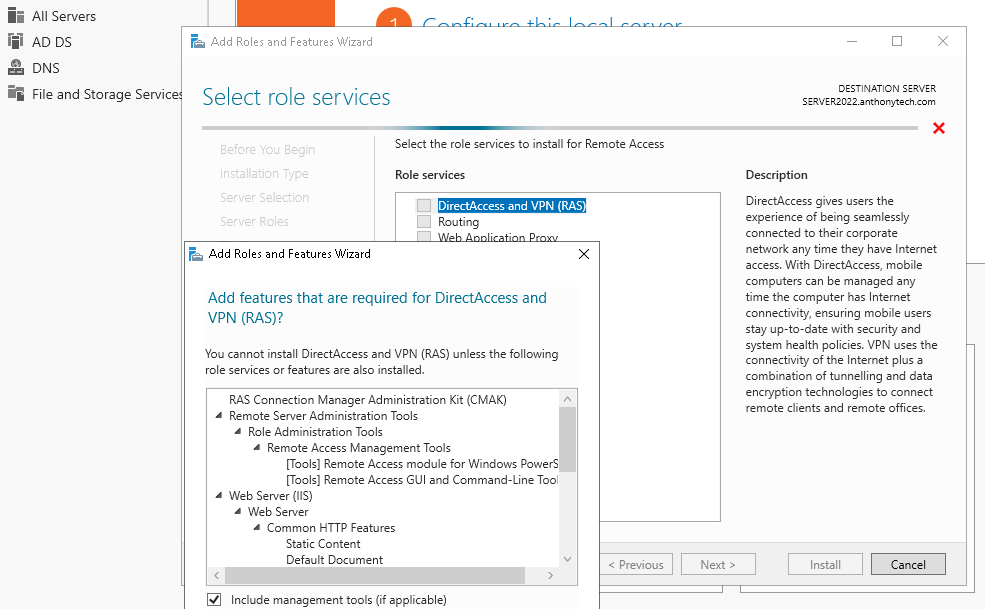

Use the Routing and Remote Access (RRAS) wizard to configure NAT routing

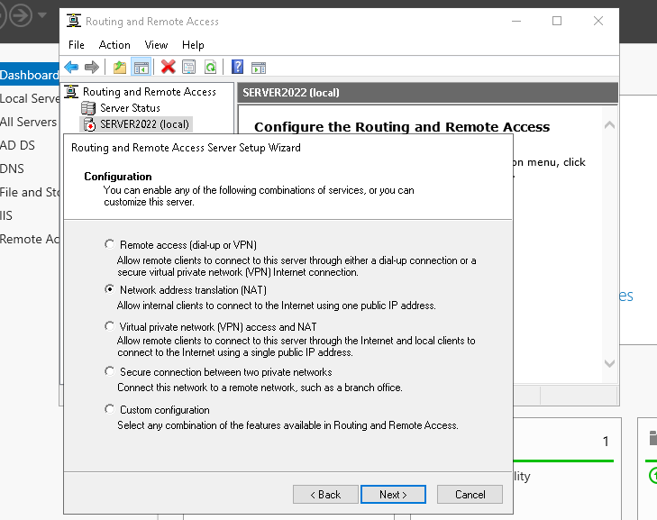

#### Step 4.3 - Installing and Configuring DHCP 

Add the DHCP Server role and tools 
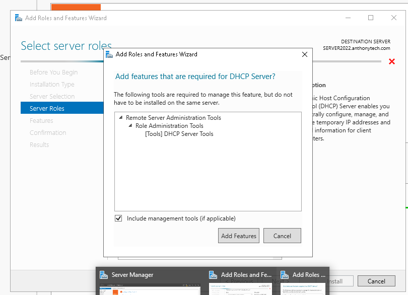

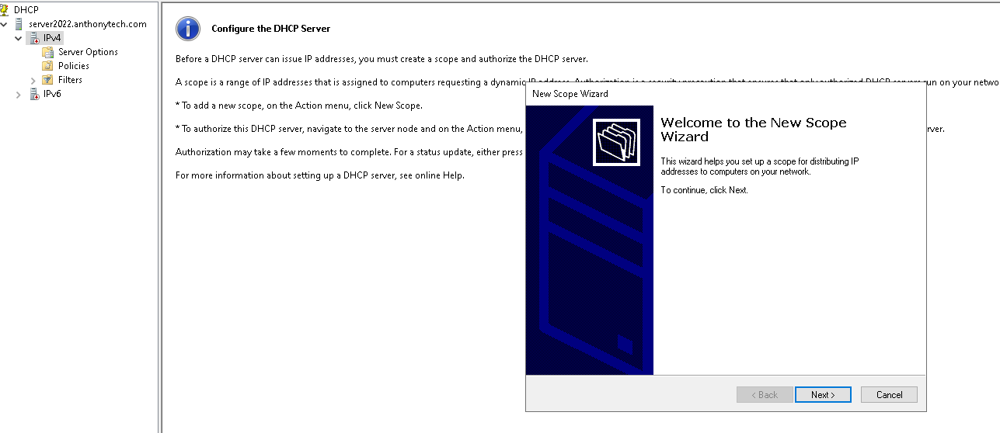

Configuring the DHCP Scope with these Configurations

- Start IP:       192.168.0.100
- End IP:         192.168.0.200
- Subnet Mask:    255.255.255.0
- Default Gateway:192.168.0.1
- DNS Server:     192.168.0.1
- Domain:         anthonytech.com
- Exclusions:     192.168.0.100 - 192.168.0.110
- Lease Duration: 7 days

Images of the configurations are down below 

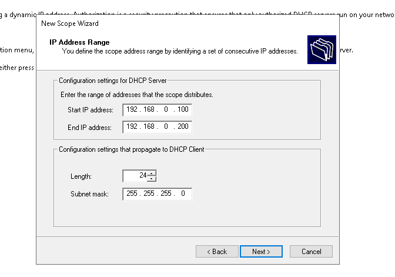

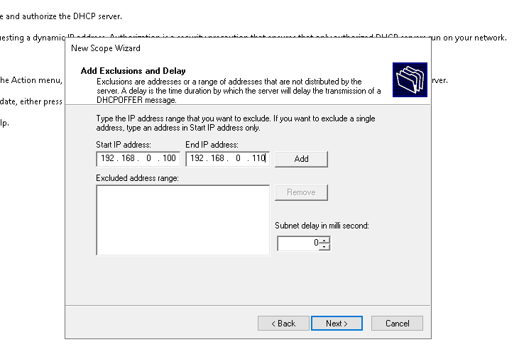

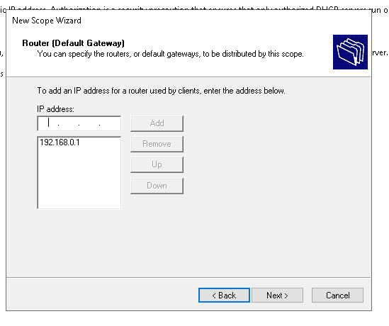

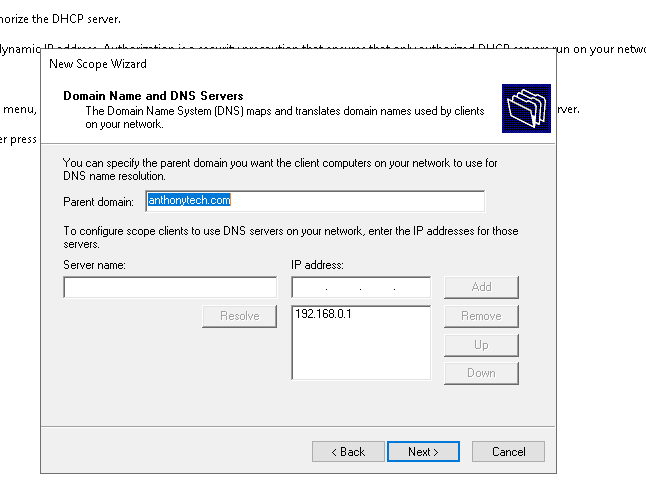

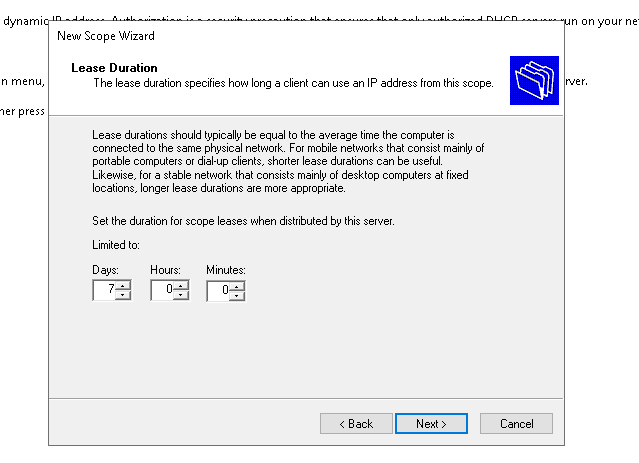

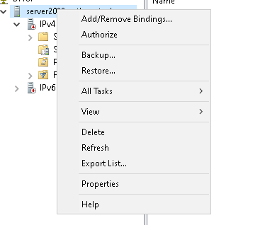

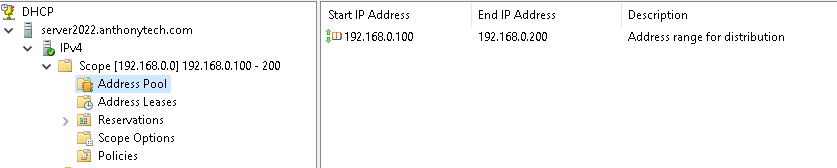

### Step 5 - Create Domain Users and Organizational Units 

After setting up Active Directory Domain Services, proceed to create specific user accounts and organize them into appropriate Organizational Units (OUs) for better management and policy application.

#### Step 5.1 : Create Organizational Units 

1. Open Active Directory Users and Computers (ADUC).
2. Right-click on your domain name (anthonytech.com) and select New > Organizational Unit.

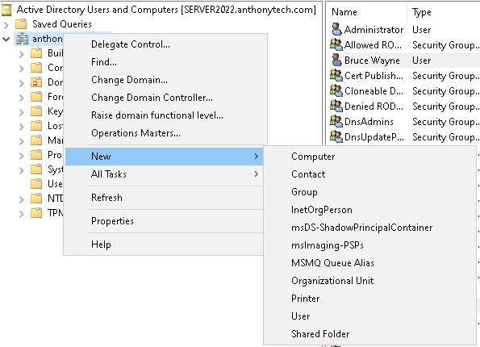

3. Name the OU IT and click OK.

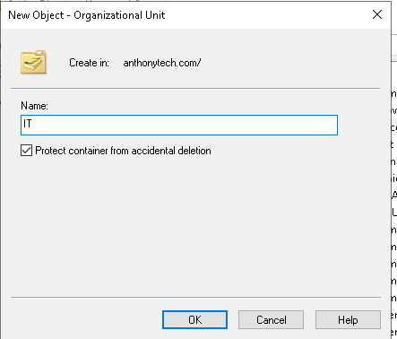

4. Repeat the process to create another OU named Finance

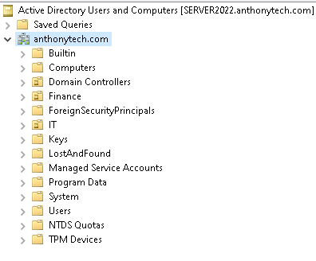

#### Step 5.1 : Create User Accounts
Helpdesk User:

1. In Active Direcotory , navigate to Users
2. Right click on the Admin account and select copy

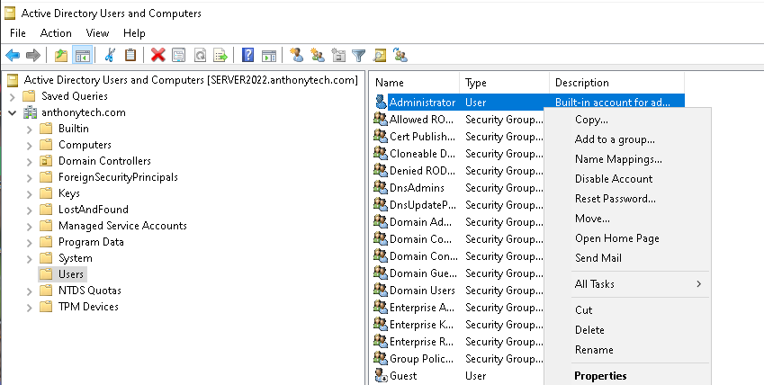

3. Enter the following details 
  - First name: Helpdesk
  - User logon name: helpdesk@anthonytech.com

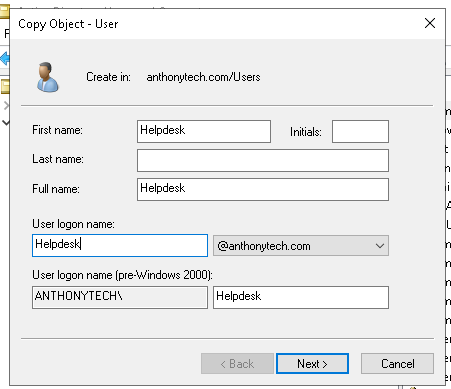

Bruce Wayne User: 
1. Navigate to Users 
2. Right click on the User folder and select > New > User

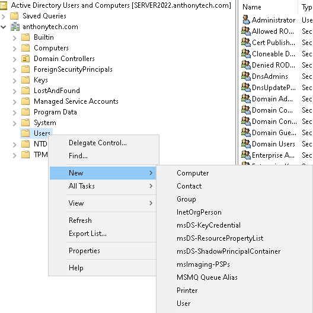

And do the same process as if you were creating the Helpdesk account earlier

## To Conclude Part 1: 

The following infrastructure is in place:

- Server 2022 VM with dual network adapters

- Static internal IP configured (192.168.0.1)

- AD, DHCP, and RAS roles installed

- Domain created: anthonytech.com

- DHCP scope configured and authorized

- Clients will be able to connect internally and reach the internet through the server

- Two User Accounts were created, First one is the Helpdesk User which will have administrative roles and be able to help end users and clients this account will be in the OU folder of IT , and save us the time to have to log into the server 2022 account evertime we have to configure something minor

- And the user account Bruce Wayne , which will simulate just a normal end user which will be in the OU folder of Finance

### If you would like to go to Part 2 ➡️ [Continue to Part 2: Client VM Setup & GPO Enforcement](https://github.com/anthonydiazz/ClientVMs)

### If you would like to go to Part 3 ➡️ [Part 3: Troubleshooting - Account Lockout and Remote Assistance](https://github.com/anthonydiazz/ClientTroubleshooting)

