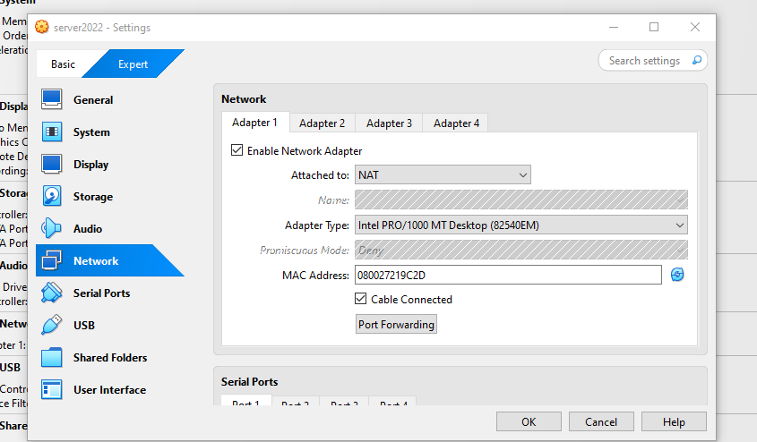
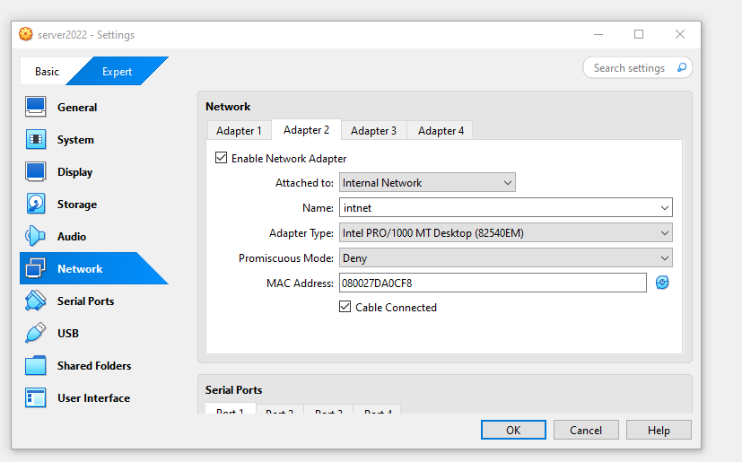
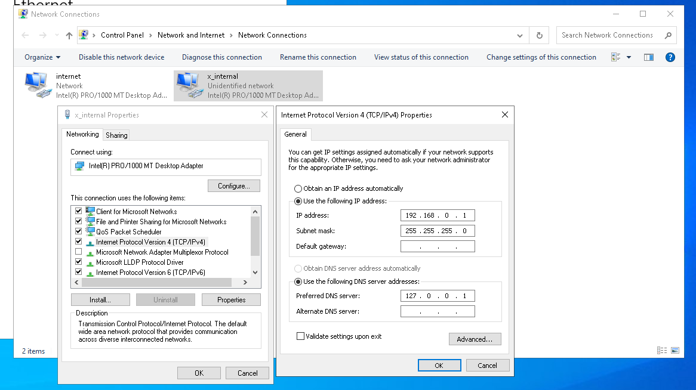
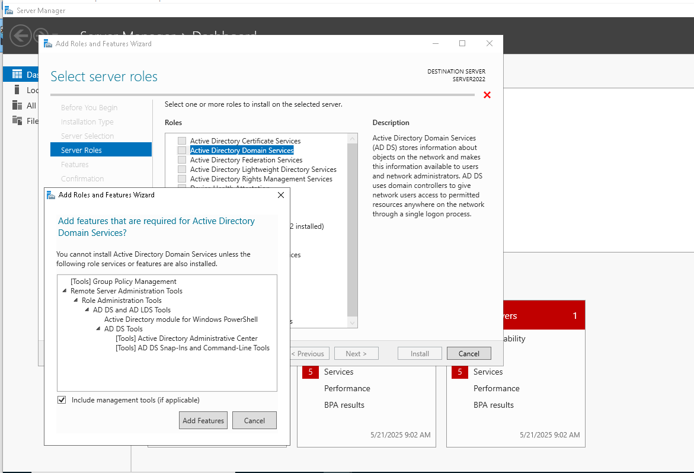
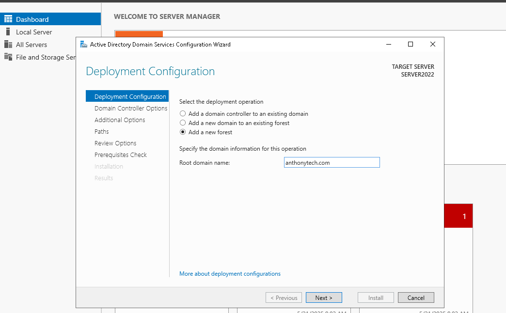
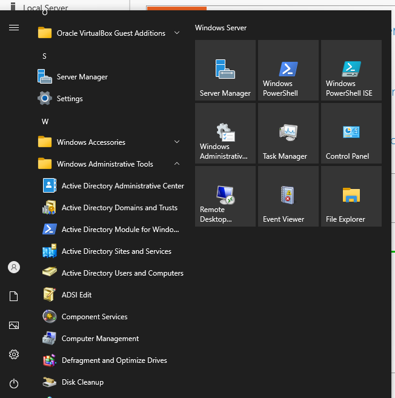

# IT Infrastructure : Windows 2022 Domain Setup
This lab project demonstrates the end-to-end setup of a virtualized IT infrastructure using Windows Server 2022 in VirtualBox. The project simulates a real-world enterprise environment by implementing domain services, DHCP, remote access, and user management through a Helpdesk structure

The environment consists of:

- A Windows Server 2022 VM acting as a domain controller, DHCP server, and router

- Two Organizational Units (IT and Finance)

- Two domain users (Helpdesk and Bruce Wayne)

- Two Windows 10 client machines joined to the domain

- Use of RSAT tools for remote helpdesk operations and GPO enforcement

##  Part 1: Setting up the Windows Server 2022 VM
### Step 1: Create the Server VM in VirtualBox and Configure Network Adapters 
- Download the Windows Server 2022 ISO and create a new VM in VirtualBox
- Assign at least 2 CPUs, 4GB RAM, and 60GB disk space (dynamically allocated)

### Setting Up Network Adapter - To Connect To The Internet  

### Setting Up Internal Adapter - Help End Users to connect to the Server 

### Step 2 : Setting Up the Internal Network with a static IP Address 
- This will enable communication with user VMs

### Step 3 : Install Core Roles 

The main purpose of this Server is for it to act as a router, dhcp server , and domain setup for anthonytech.com
- Open Server Manager and Install the following roles:

- Active Directory

Once Installed You will then have to create your domain which in this case mine is anthonytech.com 

To verify that you have installed AD, you can type on the Search bar for Windows administrative tools and it should be in that folder 

